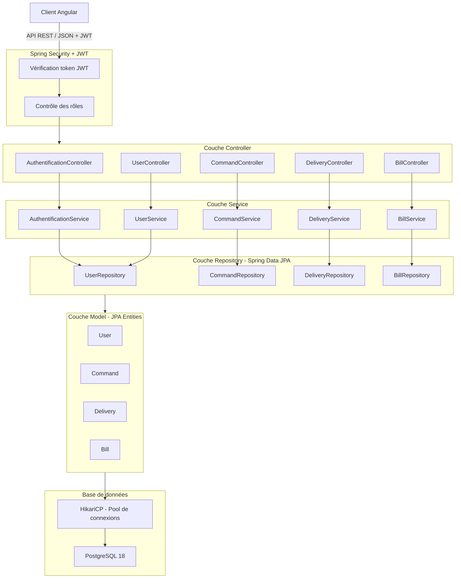
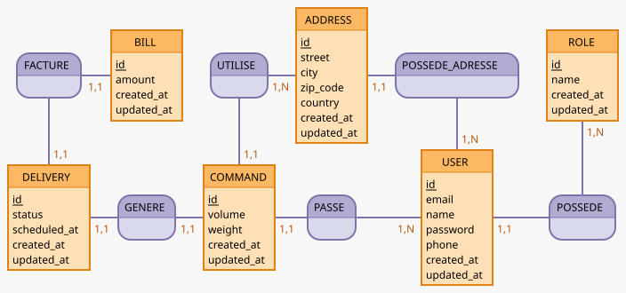
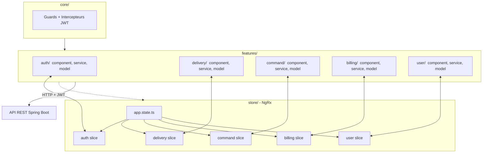
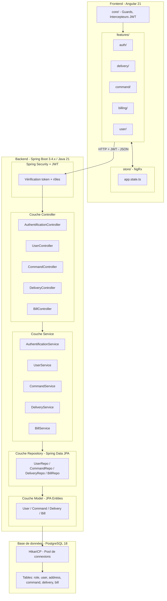

# Orientation de l'application LiVrai

## Contexte de la mission 

Le produit CRM LiVrai qui connait à l'heure actuelle une grande croissance d'activité rencontre des difficultés techniques.
Après un rapport d'audit effectué par mes soins, je dois maintenant proposer une solution technique leur permettant d'affronter leurs
prochains défis professionnels.

Pour rappel, le CRM permettait à des administrateurs de la plateforme, de créer des nouveaux comptes clients et de gérer les différentes
livraisons. Les clients, devaient passer par le service commercial afin d'obtenir un compte pour leur permettre de créer eux mêmes leurs
commandes, qui entrainaient une livraison.

## Objectifs de la refonte

L'audit de l'application existante a mis en évidence plusieurs problématiques qui justifient une refonte complète :

- **Performance** : absence de pool de connexions, requêtes sans pagination
- **Sécurité** : mots de passe en clair, absence de validation des données
- **Maintenabilité** : architecture MVC incomplète, logique métier dans les contrôleurs (servlet)
- **Évolutivité** : architecture monolithique difficile à faire évoluer et à scaler
- **Accès aux données** : migration du pattern DAO/JDBC manuel vers **Spring Data JPA** (ORM Hibernate), apportant une meilleure abstraction, 
moins de code verbeux et une gestion des transactions plus robuste.

## Grandes orientations de l'architecture cible

La refonte s'appuiera sur une stack moderne imposée par le service informatique de LiVrai :

- **Back-end** : Java 21 + Spring Boot 3.4.x (LTS)
- **Front-end** : Angular (SPA) v.21.0.0 (LTS)
- **Base de données** : PostgreSQL v.18
- **Déploiement** : conteneurisation Docker

L'architecture cible reposera sur une séparation claire front/back communiquant via une API REST, en remplacement de l'architecture monolithique
JSP/Servlet actuelle. Cette approche offre également une ouverture vers d'autres clients potentiels de l'API, comme une application mobile, sans
modification du back-end.  

## Les utilisateurs 

Dans la précédente version de l'application il y avait deux types d'utilisateurs :  

| Rôle           | Actions                                                        |
|----------------|----------------------------------------------------------------|
| Client         | Se connecter, Créer une commande, Voir ses livraisons          |
| Administrateur | Se connecter, Créer des clients, Gérer les livraisons          |

Dans la nouvelle version, les clients peuvent créer leur compte de façon autonome, sans passer par le service commercial.  

La plateforme devra accueillir un nouveau type d'utilisateur :  

| Rôle               | Actions                                                                                        |
|--------------------|------------------------------------------------------------------------------------------------|
| Client             | Créer un compte, Se connecter, Créer une commande, Voir ses livraisons, Gérer ses informations |
| Administrateur     | Se connecter, Créer des clients, Gérer les livraisons                                          |
| Service Commercial | Se connecter, Créer des clients, Gérer les livraisons, Accès à la facturation                  | 
| Service Livraison  | Se connecter, Gérer les livraisons, Accès à la facturation                                     | 

## Les fonctionnalités

Pour la nouvelle version de l'application il n'y a pas de grande évolution concernant les fonctionnalités.  
Il faut implémenter un système de rôles plus complexe que la précédente version.  
Cependant deux fonctionnalités nouvelles sont à prévoir :

1. La gestion de la facturation, qui devra être plus fine et accessible aux rôles concernés
2. La gestion des informations client (modification des coordonnées, adresses...)

Les fonctionnalités existantes seront conservées et retravaillées dans le cadre de la refonte
technique, sans ajout de périmètre fonctionnel majeur.

## Architecture Cible

### Backend

L'équipe informatique de LiVrai maîtrise l'environnement Java. Je propose une architecture backend réalisable à l'aide du framework Spring Boot.

L'architecture de l'ancienne version reposait sur une architecture MVC qui n'était pas correctement implémentée. J'ai retrouvé des informations métier
dans la partie présentation, ce qui, à terme, pourrait rendre complexe la maintenabilité du code et sa scalabilité horizontale.

Pour cette nouvelle version du CRM, je propose une architecture en couches, courante dans un environnement Spring Boot. Cette architecture garde la
même logique que l'architecture de base de l'application, donc son implémentation sera plus facile pour l'équipe et aucune formation ne sera nécessaire
pour la compréhension de celle-ci. Le contexte métier étant bien défini et non complexe, cette architecture me semble la plus adaptée au projet.

Les couches qui seront présentes :
- Controller  → reçoit les requêtes HTTP (Remplace les `Servlets`)
- Service     → contient la logique métier (Remplace le code métier contenu dans les `Servlets`de l'ancienne version)
- Repository  → accès aux données (Spring Data JPA) (Remplace les `DAO`)
- Model       → entités métier mappées sur la base de données (JPA Entities) (remplace les `Beans`)

Grâce à l'architecture MVC de base de l'application, nous avons déjà nos `Controllers` qui correspondent principalement aux `Servlets`. Pour cette
version nous aurons 5 controllers :
1. AuthentificationController
2. UserController
3. CommandController
4. DeliveryController
5. BillController (**nouveauté**: gestion de la facturation absente de l'ancienne version)

Chaque controller aura comme rôle de recevoir les requêtes HTTP du client. Une fois la requête reçue, nous allons traiter l'information à l'aide des services
liés à ce controller. Nous aurons donc, aussi, 5 services :
1. AuthentificationController → AuthentificationService
2. UserController → UserService
3. CommandController → CommandService
4. DeliveryController → DeliveryService
5. BillController → BillService

Enfin, afin de gérer la persistance des données, l'implémentation des repositories sera utilisée dans nos services via **Spring Data JPA** (ORM Hibernate).
Chaque entité métier disposera de son propre repository.

La sécurité de l'application sera assurée par **Spring Security**, qui permettra de gérer l'authentification des utilisateurs ainsi que les autorisations
par rôle (Client, Administrateur, Service Commercial, Service Livraison), une évolution nécessaire face au système de rôles plus complexe de cette nouvelle version.  

La gestion des connexions à la base de données sera assurée par un **pool de connexions HikariCP**, inclus par défaut dans Spring Boot. Contrairement à l'ancienne version qui 
recréait une connexion à chaque instanciation de DAO, HikariCP maintient un ensemble de connexions réutilisables, ce qui améliore significativement les performances sous forte 
charge et répond directement au risque de saturation identifié dans l'audit.



#### Authentification - JWT

Pour la gestion de l'authentification, nous allons opter pour une approche basée sur les **JWT (JSON Web Token)**.

Dans l'ancienne version, l'authentification reposait sur un système de session côté serveur. Cette approche est incompatible avec une architecture REST et 
complique la scalabilité horizontale, si plusieurs instances du serveur tournent en parallèle, la session est perdue en changeant d'instance.

Avec JWT, le serveur génère un token signé lors de la connexion et le retourne au client. Ce token est ensuite envoyé dans chaque requête HTTP via le header 
`Authorization`. Le serveur n'a pas besoin de stocker l'état de la session, il vérifie simplement la validité du token. Cette approche est dite **stateless** et 
s'intègre naturellement avec Spring Security et Angular.

Ce choix répond directement aux enjeux de **disponibilité** et de **scalabilité** identifiés dans l'audit.

#### Base de données - Ancienne structure

La base de données actuelle est composée de seulement deux tables : `user` et `delivery`.  

La table `user` stocke l'ensemble des utilisateurs de l'application. La gestion des rôles repose sur un simple champ booléen `admin`, ce qui ne 
permet de distinguer que deux types d'utilisateurs. Cette approche est incompatible avec le nouveau système de rôles à quatre niveaux attendu dans
la refonte. De plus, les mots de passe sont stockés en clair et aucune information complémentaire sur le client (adresse, téléphone...) n'est présente.  

La table `delivery` stocke les livraisons liées à un utilisateur via une clé étrangère `userId`. Le statut est un champ `VARCHAR` libre sans contrainte 
sur les valeurs possibles, ce qui représente un risque d'incohérence des données. Le prix est nullable car il n'est renseigné qu'au moment de la facturation, 
il n'existe pas de table dédiée à la facturation.  

On notera également l'absence de séparation entre la notion de **commande** et de **livraison**, ainsi que l'absence d'index explicites sur les colonnes 
fréquemment interrogées (`userId`, `status`).

Cette structure minimale ne peut pas supporter les nouveaux besoins fonctionnels et devra être entièrement repensée.

#### Base de données - Nouvelle structure  

La base de données sera migrée de **MySQL 8** vers **PostgreSQL 18**. Ce choix est imposé par le service informatique de LiVrai et répond aux besoins de robustesse et de scalabilité
identifiés dans l'audit. PostgreSQL offre de meilleures garanties en termes de conformité SQL, de gestion des transactions et de performances sous forte volumétrie.  

La nouvelle base de données PostgreSQL sera repensée pour répondre aux besoins fonctionnels
de la refonte. Elle s'articulera autour des entités métier suivantes :

**`user`** : Stocke les informations de tous les utilisateurs de la plateforme. Le champ booléen `admin` est remplacé par une relation vers 
une table `role`, permettant une gestion fine des quatre niveaux d'accès. Le mot de passe sera hashé (bcrypt).

**`role`** : Table dédiée à la gestion des rôles (Client, Administrateur, Service Commercial, Service Livraison). Cette séparation permet 
d'ajouter de nouveaux rôles sans modifier la structure de la table `user`.

**`address`** : Stocke les adresses de livraison liées à un utilisateur. Un utilisateur peut posséder plusieurs adresses. Cette table répond 
au besoin de gestion des informations client mentionné dans la fiche descriptive.

**`command`** : Représente une commande passée par un client. La séparation entre commande et livraison permet de mieux modéliser le cycle de vie d'une demande.

**`delivery`** : Représente la livraison associée à une commande. Le statut sera contraint par une énumération afin d'éviter les incohérences de données constatées dans 
l'ancienne version.

**`bill`** : Table dédiée à la facturation, absente de l'ancienne version. Elle permettra au Service Commercial et au Service Livraison d'accéder à la facturation de façon structurée.  

Afin de concevoir la base de donnée, j'utilise la méthide MERISE pour m'aider à cette conception.

#### Dictionnaire de données
| Attribut | Entité | Type | Contraintes | Description |
|----------|--------|------|-------------|-------------|
| **Role** | | | | |
| id | Role | SERIAL | PK, NOT NULL | Identifiant unique |
| name | Role | VARCHAR(64) | NOT NULL, UNIQUE | Nom du rôle (CLIENT, ADMIN, COMMERCIAL, LIVRAISON) |
| created_at | Role | TIMESTAMP | NOT NULL | Date de création |
| updated_at | Role | TIMESTAMP | NOT NULL | Date de dernière modification |
| **User** | | | | |
| id | User | SERIAL | PK, NOT NULL | Identifiant unique |
| email | User | VARCHAR(255) | NOT NULL, UNIQUE | Adresse email de connexion |
| name | User | VARCHAR(128) | NOT NULL | Nom complet |
| password | User | VARCHAR(255) | NOT NULL | Mot de passe hashé (bcrypt) |
| phone | User | VARCHAR(20) | NULLABLE | Numéro de téléphone |
| created_at | User | TIMESTAMP | NOT NULL | Date de création du compte |
| updated_at | User | TIMESTAMP | NOT NULL | Date de dernière modification |
| role_id | User | INT | FK → Role, NOT NULL | Rôle de l'utilisateur |
| **Address** | | | | |
| id | Address | SERIAL | PK, NOT NULL | Identifiant unique |
| street | Address | VARCHAR(255) | NOT NULL | Rue et numéro |
| city | Address | VARCHAR(128) | NOT NULL | Ville |
| zip_code | Address | VARCHAR(16) | NOT NULL | Code postal |
| country | Address | VARCHAR(64) | NOT NULL | Pays |
| created_at | Address | TIMESTAMP | NOT NULL | Date de création |
| updated_at | Address | TIMESTAMP | NOT NULL | Date de dernière modification |
| user_id | Address | INT | FK → User, NOT NULL | Propriétaire de l'adresse |
| **Command** | | | | |
| id | Command | SERIAL | PK, NOT NULL | Identifiant unique |
| volume | Command | INT | NOT NULL, > 0 | Volume en m³ |
| weight | Command | INT | NOT NULL, > 0 | Poids en kg |
| created_at | Command | TIMESTAMP | NOT NULL | Date de création |
| updated_at | Command | TIMESTAMP | NOT NULL | Date de dernière modification |
| user_id | Command | INT | FK → User, NOT NULL | Client ayant passé la commande |
| address_id | Command | INT | FK → Address, NOT NULL | Adresse de livraison |
| **Delivery** | | | | |
| id | Delivery | SERIAL | PK, NOT NULL | Identifiant unique |
| status | Delivery | VARCHAR(32) | NOT NULL, ENUM | Statut (PENDING, ACCEPTED, REJECTED, DONE) |
| scheduled_at | Delivery | TIMESTAMP | NULLABLE | Date prévue de livraison |
| created_at | Delivery | TIMESTAMP | NOT NULL | Date de création |
| updated_at | Delivery | TIMESTAMP | NOT NULL | Date de dernière modification |
| command_id | Delivery | INT | FK → Command, NOT NULL, UNIQUE | Commande associée (1-1) |
| **Bill** | | | | |
| id | Bill | SERIAL | PK, NOT NULL | Identifiant unique |
| amount | Bill | DECIMAL(10,2) | NOT NULL, > 0 | Montant de la facture |
| created_at | Bill | TIMESTAMP | NOT NULL | Date de facturation |
| updated_at | Bill | TIMESTAMP | NOT NULL | Date de dernière modification |
| delivery_id | Bill | INT | FK → Delivery, NOT NULL, UNIQUE | Livraison facturée (1-1) |
#### MLD
```
ROLE (id, name, created_at, updated_at)
USER (id, email, name, password, phone, created_at, updated_at, #role_id)
ADDRESS (id, street, city, zip_code, country, created_at, updated_at, #user_id)
COMMAND (id, volume, weight, created_at, updated_at, #user_id, #address_id)
DELIVERY (id, status, scheduled_at, created_at, updated_at, #command_id)
BILL (id, amount, created_at, updated_at, #delivery_id)
```

#### MCD


### Frontend

Concernant la partie frontend, l'application actuelle repose sur un environnement Java complet. Les vues sont générées côté serveur via 
des fichiers **JSP**. Une des exigences techniques est de transformer cet aspect en utilisant le framework **Angular 21 (LTS)** afin d'obtenir 
une **Single Page Application (SPA)** plus interactive et plus réactive pour l'utilisateur.  

Contrairement à l'ancienne architecture où chaque action entraînait un rechargement complet de la page, Angular permettra de mettre à jour 
uniquement les parties concernées de l'interface, sans rechargement.  

#### Gestion d'état - NgRx

Pour gérer l'état de l'application, nous allons mettre en place **NgRx**, une bibliothèque de gestion d'état inspirée du pattern Redux.

Dans une application Angular sans gestion d'état centralisée, chaque composant gère ses propres données. Cela devient rapidement problématique
quand plusieurs composants ont besoin des mêmes informations, par exemple, le statut d'une livraison affiché simultanément dans la liste et
dans le détail.

NgRx résout ce problème en centralisant toutes les données dans un **store** unique et immuable.
Pour LiVrai, cela sera particulièrement utile pour :

- La gestion de la session utilisateur (token JWT, rôle)
- La liste des livraisons partagée entre plusieurs vues
- La synchronisation des statuts de livraison en temps réel


#### Architecture

Pour la partie Angular nous allons adopter une architecture **Standalone Feature-based**, qui est le standard recommandé depuis Angular 17
et par défaut dans Angular 21.

L'ancienne approche par modules (`NgModule`) découpait l'application de façon **technique**, tous les composants ensemble, tous les services
ensemble, tous les modèles ensemble. Cette organisation devient rapidement difficile à maintenir quand l'application grandit : modifier
une fonctionnalité implique de naviguer dans plusieurs dossiers distincts.

L'architecture Feature-based adopte un découpage **métier**, tout ce qui concerne une fonctionnalité est regroupé au même endroit.

Pour LiVrai, cela donnera :
```
app/
  core/           -> services globaux, guards, intercepteurs JWT
  store/          -> store global
    app.state.ts  -> interface globale qui agrège tous les états
  features/
    auth/         -> connexion, inscription
    delivery/     -> liste et suivi des livraisons
    command/      -> création de commande
    billing/      -> facturation
    user/         -> gestion du profil client
```

Le store **NgRx** viendra compléter cette architecture en ajoutant une couche de gestion d'état centralisée.

Chaque feature disposera de ses propres fichiers organisés ainsi :
```
app/
  features/
    delivery/
      delivery.component.ts  -> affichage
      delivery.service.ts    -> appels HTTP vers l'API REST
      delivery.model.ts      -> interfaces TypeScript
      store/                 -> slice delivery
        delivery.actions.ts    -> actions déclenchées par l'utilisateur
        delivery.reducer.ts    -> mise à jour de l'état
        delivery.selectors.ts  -> lecture de l'état
        delivery.effects.ts    -> appels API via le service
```

Le flux de données suit le pattern suivant :
```
Composant → dispatch action → Effect → Service → API REST
                                 ↓
                             Reducer → Store → Selector → Composant
```

Les **services** sont appelés par les **effects** NgRx pour réaliser les appels HTTP, jamais directement par les composants.
Cette séparation garantit que l'état de l'application est **prévisible et centralisé**, plusieurs composants peuvent lire
les mêmes données sans risque d'incohérence, ce qui est particulièrement important pour le suivi en temps réel des statuts
de livraison.

Cette organisation s'aligne naturellement avec les controllers du backend et facilite la maintenance, un développeur
travaillant sur la feature "livraison" sait exactement où trouver tous les fichiers concernés.

#### Schéma architecture front


### Communication front/back

La communication entre le frontend Angular et le backend Spring Boot repose sur une **API REST** exposée par le backend. Les échanges se 
font exclusivement au format **JSON** via le module `HttpClient` d'Angular.

#### Authentification et gestion du JWT

Lors de la connexion, le backend retourne un **token JWT** que le frontend stocke localement. Ce token est ensuite automatiquement ajouté à 
chaque requête HTTP sortante grâce à un **intercepteur HTTP** (`AuthInterceptor`) configuré dans le dossier `core/`.

Le flux d'authentification est le suivant :

1. L'utilisateur saisit ses identifiants
2. Angular envoie une requête `POST /api/auth/login`
3. Le backend valide et retourne un token JWT
4. L'intercepteur ajoute le token dans le header `Authorization: Bearer <token>` de chaque requête suivante
5. Spring Security valide le token à chaque requête entrante

#### Protection des routes

Côté Angular, les routes seront protégées par des **Guards** (`AuthGuard`, `RoleGuard`) configurés dans `core/`. Un utilisateur non 
connecté sera redirigé vers la page de connexion. Un utilisateur connecté mais sans le bon rôle sera redirigé vers une page d'erreur.

Côté backend, Spring Security vérifie le token JWT et le rôle à chaque requête, la sécurité est donc assurée aux deux niveaux.

### Contrat d'API

#### Ancienne architecture (Servlets)

| URL | Méthode | Description |
|-----|---------|-------------|
| `/login` | GET | Affiche la page de connexion |
| `/login` | POST | Traite le formulaire de connexion |
| `/logout` | GET | Déconnecte l'utilisateur |
| `/clients` | GET | Affiche la liste des clients |
| `/clients` | POST | Crée un nouveau client |
| `/livraisons` | GET | Affiche la liste des livraisons |
| `/livraison` | POST | Accepte, refuse ou facture une livraison |
| `/commande` | GET | Affiche le formulaire de commande |
| `/commande` | POST | Crée une nouvelle commande |

#### Nouvelle architecture (API REST Spring Boot)

| Endpoint | Méthode | Rôle requis | Description |
|----------|---------|-------------|-------------|
| `/api/auth/login` | POST | Public | Connexion et génération du token JWT |
| `/api/auth/register` | POST | Public | Création de compte client |
| `/api/users` | GET | ADMIN | Liste tous les utilisateurs |
| `/api/users/{id}` | GET | ADMIN, COMMERCIAL | Détail d'un utilisateur |
| `/api/users/{id}` | PUT | ADMIN, CLIENT | Modification des informations |
| `/api/users/{id}` | DELETE | ADMIN | Suppression d'un utilisateur |
| `/api/commands` | GET | ADMIN, COMMERCIAL | Liste toutes les commandes |
| `/api/commands` | POST | CLIENT | Crée une nouvelle commande |
| `/api/commands/{id}` | GET | ADMIN, COMMERCIAL, CLIENT | Détail d'une commande |
| `/api/deliveries` | GET | ADMIN, COMMERCIAL, LIVRAISON | Liste toutes les livraisons |
| `/api/deliveries/{id}` | GET | ADMIN, COMMERCIAL, LIVRAISON, CLIENT | Détail d'une livraison |
| `/api/deliveries/{id}/accept` | PATCH | ADMIN, LIVRAISON | Accepte une livraison |
| `/api/deliveries/{id}/reject` | PATCH | ADMIN, LIVRAISON | Refuse une livraison |
| `/api/bills` | GET | ADMIN, COMMERCIAL, LIVRAISON | Liste toutes les factures |
| `/api/bills/{id}` | GET | ADMIN, COMMERCIAL, LIVRAISON | Détail d'une facture |
| `/api/bills` | POST | ADMIN, COMMERCIAL | Crée une facture |

### Architecture globale cible



### Stratégie de migration

La refonte implique deux niveaux de migration simultanés : un changement de **moteur de base de données** (MySQL 8 → PostgreSQL 18) et 
une **restructuration complète du schéma de données**.  

#### Données à migrer

| Ancienne table | Nouvelle(s) table(s) | Transformation nécessaire |
|----------------|---------------------|--------------------------|
| `user` | `role` + `user` | Convertir le booléen `admin` en `role_id` |
| `delivery` | `command` + `delivery` | Créer une `command` pour chaque `delivery` existante |

#### Script de la nouvelle architecture 

```sql
-- ============================================================
-- Script de création de la base de données LiVrai
-- PostgreSQL 18
-- ============================================================

-- Création du type ENUM pour les statuts de livraison
CREATE TYPE delivery_status AS ENUM ('PENDING', 'ACCEPTED', 'REJECTED', 'DONE');

-- Table : role
CREATE TABLE IF NOT EXISTS role (
    id         SERIAL PRIMARY KEY,
    name       VARCHAR(64)  NOT NULL UNIQUE,
    created_at TIMESTAMP    NOT NULL DEFAULT NOW(),
    updated_at TIMESTAMP    NOT NULL DEFAULT NOW()
    );

-- Données initiales : rôles (ordre important: CLIENT aura l'id 2)
INSERT INTO role (id, name) VALUES
    (1, 'ADMIN'),
    (2, 'CLIENT'),
    (3, 'SERVICE_COMMERCIAL'),
    (4, 'SERVICE_LIVRAISON');

-- Table : user
CREATE TABLE IF NOT EXISTS "user" (
    id         SERIAL PRIMARY KEY,
    email      VARCHAR(255) NOT NULL UNIQUE,
    name       VARCHAR(128) NOT NULL,
    password   VARCHAR(255) NOT NULL,
    phone      VARCHAR(20),
    created_at TIMESTAMP    NOT NULL DEFAULT NOW(),
    updated_at TIMESTAMP    NOT NULL DEFAULT NOW(),
    role_id    INT          NOT NULL DEFAULT 2,
    CONSTRAINT fk_user_role FOREIGN KEY (role_id) REFERENCES role(id)
    );

-- Table : address
CREATE TABLE IF NOT EXISTS address (
    id         SERIAL PRIMARY KEY,
    street     VARCHAR(255) NOT NULL,
    city       VARCHAR(128) NOT NULL,
    zip_code   VARCHAR(16)  NOT NULL,
    country    VARCHAR(64)  NOT NULL,
    created_at TIMESTAMP    NOT NULL DEFAULT NOW(),
    updated_at TIMESTAMP    NOT NULL DEFAULT NOW(),
    user_id    INT          NOT NULL,
    CONSTRAINT fk_address_user FOREIGN KEY (user_id) REFERENCES "user"(id)
    );

-- Table : command
CREATE TABLE IF NOT EXISTS command (
    id         SERIAL PRIMARY KEY,
    volume     INT          NOT NULL CHECK (volume > 0),
    weight     INT          NOT NULL CHECK (weight > 0),
    created_at TIMESTAMP    NOT NULL DEFAULT NOW(),
    updated_at TIMESTAMP    NOT NULL DEFAULT NOW(),
    user_id    INT          NOT NULL,
    address_id INT          NOT NULL,
    CONSTRAINT fk_command_user    FOREIGN KEY (user_id)    REFERENCES "user"(id),
    CONSTRAINT fk_command_address FOREIGN KEY (address_id) REFERENCES address(id)
    );

-- Table : delivery
CREATE TABLE IF NOT EXISTS delivery (
    id           SERIAL PRIMARY KEY,
    status       delivery_status NOT NULL DEFAULT 'PENDING',
    scheduled_at TIMESTAMP,
    created_at   TIMESTAMP       NOT NULL DEFAULT NOW(),
    updated_at   TIMESTAMP       NOT NULL DEFAULT NOW(),
    command_id   INT             NOT NULL UNIQUE,
    CONSTRAINT fk_delivery_command FOREIGN KEY (command_id) REFERENCES command(id)
    );

-- Table : bill
CREATE TABLE IF NOT EXISTS bill (
    id          SERIAL PRIMARY KEY,
    amount      DECIMAL(10,2) NOT NULL CHECK (amount > 0),
    created_at  TIMESTAMP     NOT NULL DEFAULT NOW(),
    updated_at  TIMESTAMP     NOT NULL DEFAULT NOW(),
    delivery_id INT           NOT NULL UNIQUE,
    CONSTRAINT fk_bill_delivery FOREIGN KEY (delivery_id) REFERENCES delivery(id)
    );

-- Index pour optimiser les recherches fréquentes
CREATE INDEX idx_user_email      ON "user"(email);
CREATE INDEX idx_user_role       ON "user"(role_id);
CREATE INDEX idx_command_user    ON command(user_id);
CREATE INDEX idx_delivery_status ON delivery(status);
```

#### Points de vigilance

**Mots de passe en clair**  
Les mots de passe de l'ancienne base sont stockés en clair. Lors de la migration, il suffira de les hasher avec **bcrypt** et de 
les stocker dans la nouvelle base. Aucune intervention des utilisateurs n'est nécessaire.

C'est d'ailleurs l'un des rares avantages de l'ancienne implémentation non sécurisée, les mots de passe étant lisibles, la migration 
vers un stockage sécurisé est directement possible.  

**Conversion des rôles**  
Le champ `admin` booléen doit être converti en `role_id` :
- `admin = TRUE` → rôle `ADMIN`
- `admin = FALSE` → rôle `CLIENT`

Les nouveaux rôles `SERVICE_COMMERCIAL` et `SERVICE_LIVRAISON` devront être attribués manuellement par l'administrateur après la migration.  

**Séparation commande / livraison**  
L'ancienne table `delivery` joue les deux rôles. Pour chaque enregistrement existant, il faudra créer une entrée dans `command` et une 
entrée dans `delivery` liées entre elles.  

#### Planification de la migration

La migration devra être planifiée sur un **weekend** afin de minimiser l'impact sur les utilisateurs de LiVrai. La procédure recommandée 
est la suivante :  

1. **Vendredi soir** : mise en maintenance de l'application, blocage des accès
2. **Export des données** : extraction complète de la base MySQL via `mysqldump`
3. **Création de la nouvelle structure** : exécution du script `init-schema.sql` sur PostgreSQL
4. **Transformation et import des données** :
    - Hashage bcrypt des mots de passe
    - Conversion des rôles (`admin` → `role_id`)
    - Création des commandes à partir des livraisons existantes
5. **Tests de validation** : vérification de l'intégrité des données migrées
6. **Déploiement de la nouvelle application** : mise en production sur la nouvelle stack
7. **Dimanche soir** : remise en production et levée de la maintenance

#### Remarque

Le script de migration détaillé (transformation et import des données) sera produit lors de la phase d'implémentation, une fois 
la nouvelle architecture validée. Il fera l'objet d'un livrable séparé et sera testé sur un environnement de recette avant toute exécution
en production.