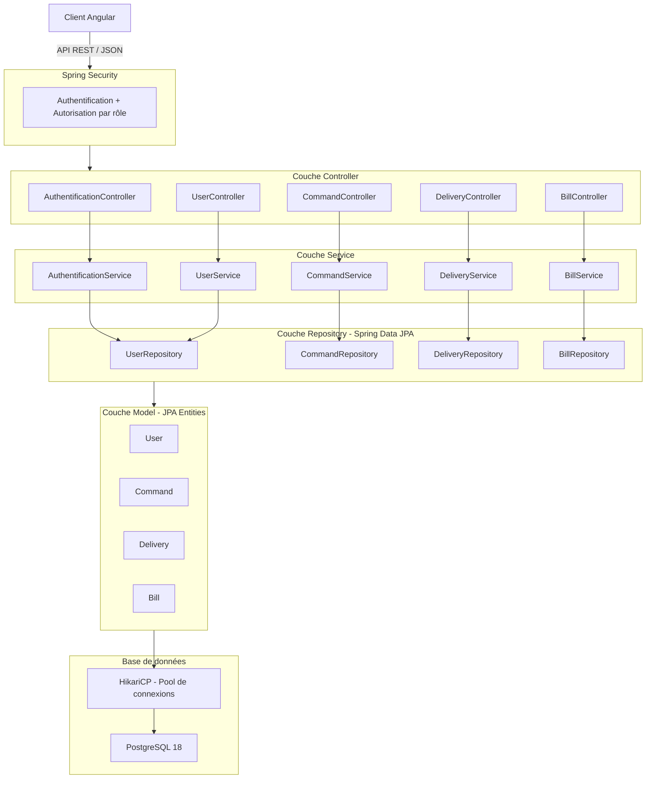

# Orientation de l'application LiVrai

## Contexte de la mission 

Le produit CRM LiVrai qui connait à l'heure actuelle une grande croissance d'activité rencontre des difficultés techniques.
Après un rapport d'audit effectué par mes soins, je dois maintenant proposer une solution technique leur permettant d'affronter leurs
prochains défis professionnels.

Pour rappel, le CRM permettait à des administrateurs de la plateforme, de créer des nouveaux comptes clients et de gérer les différentes
livraisons. Les clients, devaient passer par le service commercial afin d'obtenir un compte pour leur permettre de créer eux mêmes leurs
commandes, qui entrainaient une livraison.

## Objectifs de la refonte

L'audit de l'application existante a mis en évidence plusieurs problématiques qui justifient une refonte complète :

- **Performance** : absence de pool de connexions, requêtes sans pagination
- **Sécurité** : mots de passe en clair, absence de validation des données
- **Maintenabilité** : architecture MVC incomplète, logique métier dans les contrôleurs (servlet)
- **Évolutivité** : architecture monolithique difficile à faire évoluer et à scaler
- **Accès aux données** : migration du pattern DAO/JDBC manuel vers **Spring Data JPA** (ORM Hibernate), apportant une meilleure abstraction, 
moins de code verbeux et une gestion des transactions plus robuste.

## Grandes orientations de l'architecture cible

La refonte s'appuiera sur une stack moderne imposée par le service informatique de LiVrai :

- **Back-end** : Java 21 + Spring Boot 3.4.x (LTS)
- **Front-end** : Angular (SPA) v.21.0.0 (LTS)
- **Base de données** : PostgreSQL v.18
- **Déploiement** : conteneurisation Docker

L'architecture cible reposera sur une séparation claire front/back communiquant via une API REST, en remplacement de l'architecture monolithique
JSP/Servlet actuelle. Cette approche offre également une ouverture vers d'autres clients potentiels de l'API, comme une application mobile, sans
modification du back-end.  

## Les utilisateurs 

Dans la précédente version de l'application il y avait deux types d'utilisateurs :  

| Rôle           | Actions                                                        |
|----------------|----------------------------------------------------------------|
| Client         | Se connecter, Créer une commande, Voir ses livraisons          |
| Administrateur | Se connecter, Créer des clients, Gérer les livraisons          |

Dans la nouvelle version, les clients peuvent créer leur compte de façon autonome, sans passer par le service commercial.  

La plateforme devra accueillir un nouveau type d'utilisateur :  

| Rôle               | Actions                                                                                        |
|--------------------|------------------------------------------------------------------------------------------------|
| Client             | Créer un compte, Se connecter, Créer une commande, Voir ses livraisons, Gérer ses informations |
| Administrateur     | Se connecter, Créer des clients, Gérer les livraisons                                          |
| Service Commercial | Se connecter, Créer des clients, Gérer les livraisons, Accès à la facturation                  | 
| Service Livraison  | Se connecter, Gérer les livraisons, Accès à la facturation                                     | 

## Les fonctionnalités

Pour la nouvelle version de l'application il n'y a pas de grande évolution concernant les fonctionnalités.  
Il faut implémenter un système de rôles plus complexe que la précédente version.  
Cependant deux fonctionnalités nouvelles sont à prévoir :

1. La gestion de la facturation, qui devra être plus fine et accessible aux rôles concernés
2. La gestion des informations client (modification des coordonnées, adresses...)

Les fonctionnalités existantes seront conservées et retravaillées dans le cadre de la refonte
technique, sans ajout de périmètre fonctionnel majeur.

## Architecture Cible

### Backend

L'équipe informatique de LiVrai maîtrise l'environnement Java. Je propose une architecture backend réalisable à l'aide du framework Spring Boot.

L'architecture de l'ancienne version reposait sur une architecture MVC qui n'était pas correctement implémentée. J'ai retrouvé des informations métier
dans la partie présentation, ce qui, à terme, pourrait rendre complexe la maintenabilité du code et sa scalabilité horizontale.

Pour cette nouvelle version du CRM, je propose une architecture en couches, courante dans un environnement Spring Boot. Cette architecture garde la
même logique que l'architecture de base de l'application, donc son implémentation sera plus facile pour l'équipe et aucune formation ne sera nécessaire
pour la compréhension de celle-ci. Le contexte métier étant bien défini et non complexe, cette architecture me semble la plus adaptée au projet.

Les couches qui seront présentes :
- Controller  → reçoit les requêtes HTTP (Remplace les `Servlets`)
- Service     → contient la logique métier (Remplace le code métier contenu dans les `Servlets`de l'ancienne version)
- Repository  → accès aux données (Spring Data JPA) (Remplace les `DAO`)
- Model       → entités métier mappées sur la base de données (JPA Entities) (remplace les `Beans`)

Grâce à l'architecture MVC de base de l'application, nous avons déjà nos `Controllers` qui correspondent principalement aux `Servlets`. Pour cette
version nous aurons 5 controllers :
1. AuthentificationController
2. UserController
3. CommandController
4. DeliveryController
5. BillController (**nouveauté**: gestion de la facturation absente de l'ancienne version)

Chaque controller aura comme rôle de recevoir les requêtes HTTP du client. Une fois la requête reçue, nous allons traiter l'information à l'aide des services
liés à ce controller. Nous aurons donc, aussi, 5 services :
1. AuthentificationController → AuthentificationService
2. UserController → UserService
3. CommandController → CommandService
4. DeliveryController → DeliveryService
5. BillController → BillService

Enfin, afin de gérer la persistance des données, l'implémentation des repositories sera utilisée dans nos services via **Spring Data JPA** (ORM Hibernate).
Chaque entité métier disposera de son propre repository.

La sécurité de l'application sera assurée par **Spring Security**, qui permettra de gérer l'authentification des utilisateurs ainsi que les autorisations
par rôle (Client, Administrateur, Service Commercial, Service Livraison), une évolution nécessaire face au système de rôles plus complexe de cette nouvelle version.  

La gestion des connexions à la base de données sera assurée par un **pool de connexions HikariCP**, inclus par défaut dans Spring Boot. Contrairement à l'ancienne version qui 
recréait une connexion à chaque instanciation de DAO, HikariCP maintient un ensemble de connexions réutilisables, ce qui améliore significativement les performances sous forte 
charge et répond directement au risque de saturation identifié dans l'audit.  

### Base de données

La base de données sera migrée de **MySQL 8** vers **PostgreSQL 18**. Ce choix est imposé par le service informatique de LiVrai et répond aux besoins de robustesse et de scalabilité 
identifiés dans l'audit. PostgreSQL offre de meilleures garanties en termes de conformité SQL, de gestion des transactions et de performances sous forte volumétrie.  